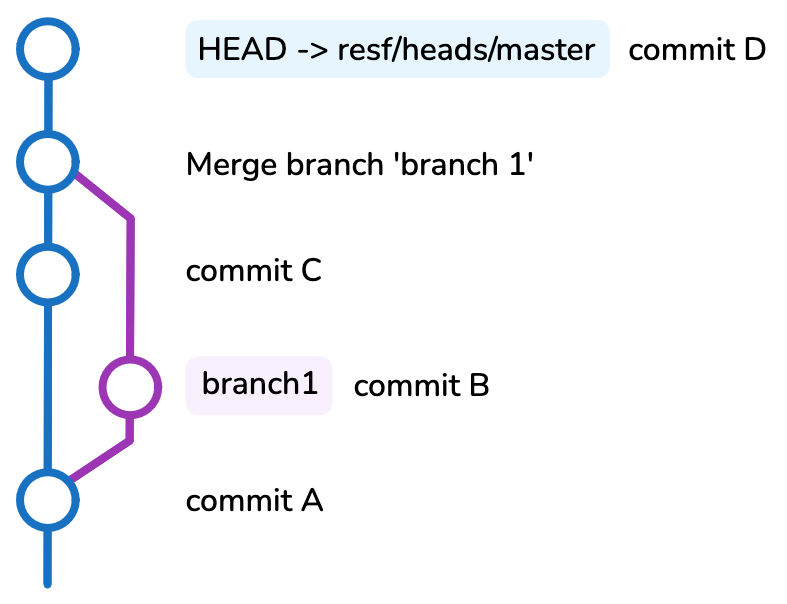

```{=typst}
#import "@preview/cheq:0.3.0": checklist
#show: checklist
```

## Déroulé

- L'évaluation se tiendra **en salle**, pour une durée de **deux heures**.
- Toutes les ressources sont **disponibles** (cours, internet).
- Il vous est demandé de **ne pas communiquer** entre vous le temps de l'évaluation.

## Rendu

- À la fin du temps imparti, il vous sera demandé de créer un **fichier zip** de votre projet RStudio.
- Le fichier zip se nommera `prenom.nom.m1ecap.zip`, **sans caractère spécial ni espace**.
    - `usethis:::check_package_name("prenom.nom.m1ecap")`
- Vous déposerez votre fichier zip sur le [**dépôt cloud**](https://uncloud.univ-nantes.fr/index.php/s/dr2tsRtWwrya484)
- Attendez de recevoir la **validation** de votre dépôt avant de quitter la salle.

## Jeu de donnée

Le jeu de donnée utilisé pour l'évaluation doit respecter ces contraintes :

- un seul fichier, disponible et téléchargeable en open data
- contient à minima une variable catégorielle et une variable quantitative exploitable
- format `csv`, `parquet`, `excel` ou `json`, taille maximale de 500 ko

Pour les jeux de données bruts volumineux, fournir dans votre dossier rendu **le code R utilisé pour réaliser l'ensemble des étapes d'extraction**.

Si aucun jeu de donnée n'a été sélectionné avant la date de l'évaluation, vous utiliserez le jeu de donnée **[alerte pollen](https://data.loire-atlantique.fr/explore/dataset/323266205_alerte-pollens-nantes%2540nantesmetropole/information/)** téléchargeable _[ici](https://data.loire-atlantique.fr/api/explore/v2.1/shared/datasets/323266205_alerte-pollens-nantes@nantesmetropole/exports/csv?lang=fr&timezone=Europe%2FBerlin&use_labels=true&delimiter=%3B)_.

## Grille d'évaluation

Chaque élément de la liste correctement réalisé rapporte **1pt**.

###  Création de package

```{=typst}
- [ ] Le dossier rendu est correctement nommé et contient un projet RStudio
- [ ] Le dossier rendu est un package
- [ ] Le package peut être installé localement
```

###  Données

```{=typst}
- [ ] Le package contient un jeu de donnée dans le sous-dossier `data/`
- [ ] Ce jeu de donnée est disponible quand on charge le package dans un nouvelle session R
- [ ] Ce jeu de données respecte les contraintes mentionnées plus haut\*
```

\* Préciser la source du jeu de donnée (dans le `README` ou la documentation du jeu)
Ce point ne sera pas validé si vous utilisez le jeu de données _alerte pollen_

### Git

```{=typst}
- [ ] Le dossier rendu est un répertoire git
- [ ] L'historique des commits contient au moins un `merge` par _Pull Request_ GitHub
- [ ] Les messages de commit sont cohérents avec les modifications associées
- [ ] La phrase suivante est complétée et ajoutée dans le README :
    - _Le premier commit de ce répertoire a été effectué à xxhxx et son SHA est xxxxxxxxxxxxxxxxxx_
- [ ] La réponse à l'exercice suivant est donnée dans le README :
    - _Complétez la suite de commande `git` à exécuter (hors `git add`) pour obtenir l'historique ci-dessous :_
```

{fig-align="center" width=40%}

```{bash}
#| eval: false
git checkout master
git commit -m "commit A"
# ...
```

### Fonctions

```{=typst}
- [ ] Une des fonctions du package réalise un calcul sur le jeu de données (_eg_ `mean`, `max`, `median`)
- [ ] Une des fonctions du package réalise un filtre sur le jeu de données
- [ ] Une des fonctions du package réalise un graphique `ggplot2` à partir du jeu de données
- [ ] Une des fonctions du package est appelée dans une autre fonction du package
```

### Développement de package

```{=typst}
- [ ] L'appel à `devtools::check()` ne renvoie pas d'_erreur_
- [ ] Les fonctions sont documentées avec `roxygen2`
- [ ] Ce point correspont à la couverture de test du package
    - _eg_ `covr::package_coverage()` rend `prenom.nom.m1ecap Coverage: 30.77%`  : 0.3pt
- [ ] Une vignette existe et utilise au moins une des fonctions du package
- [ ] L'appel à `devtools::check()` ne renvoie ni de _warning_, ni de _note_\*
```

\*On ignorera la note `unable to verify current time`
