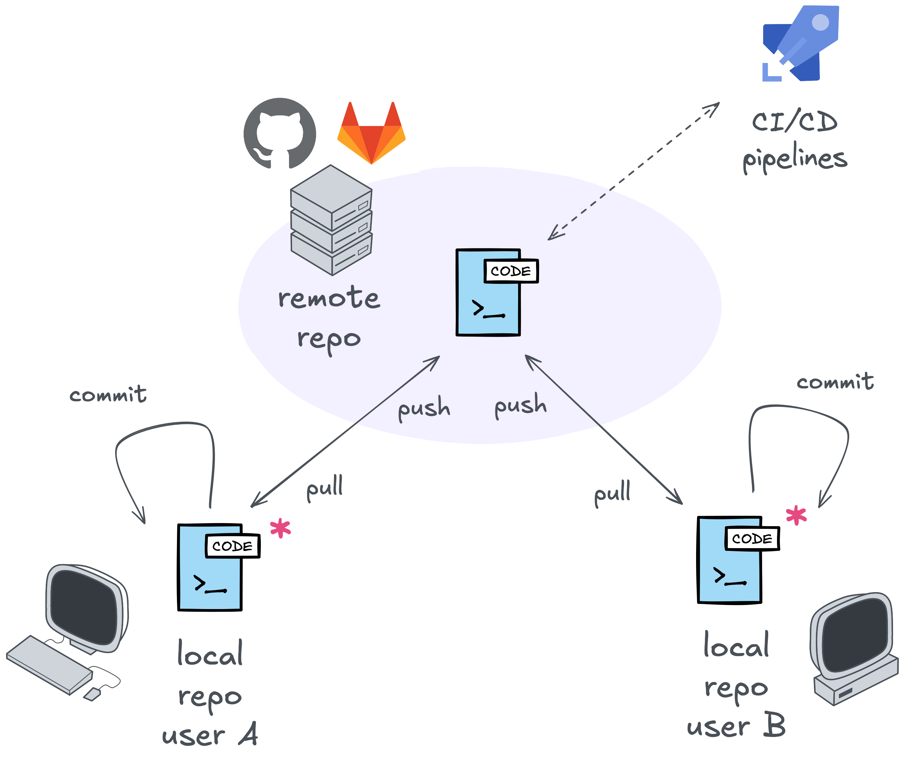
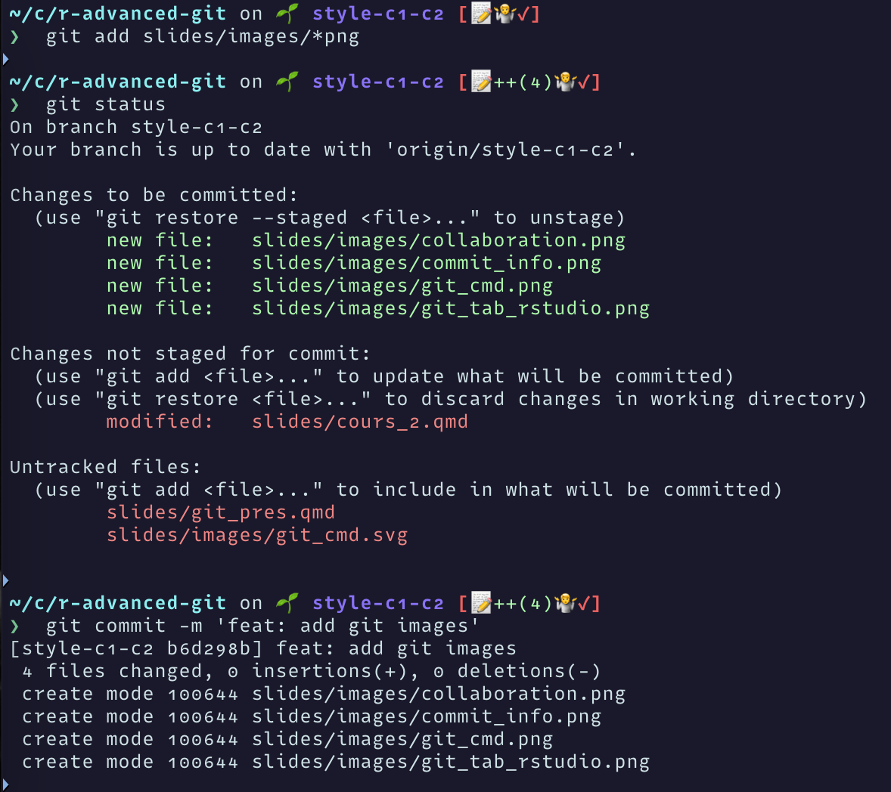
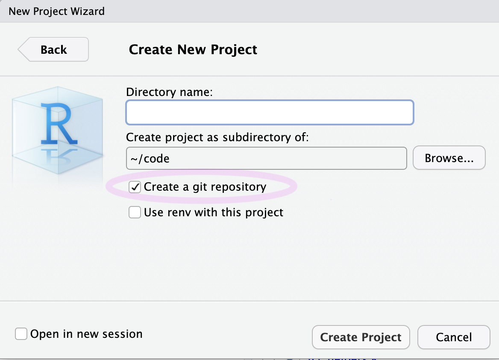
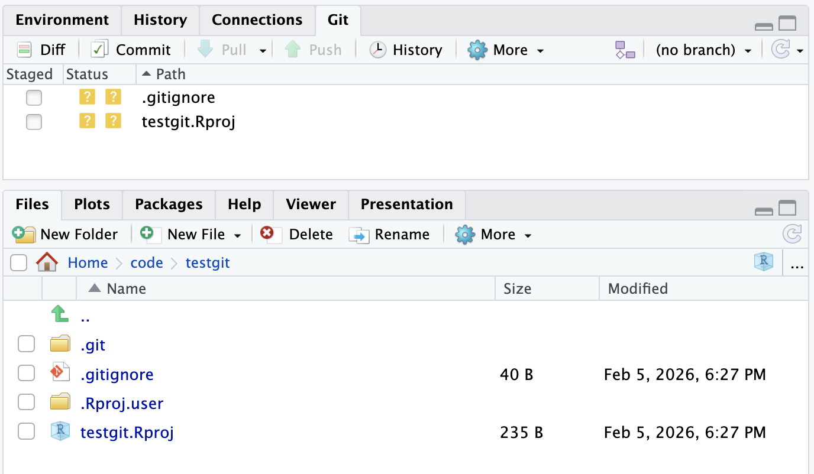
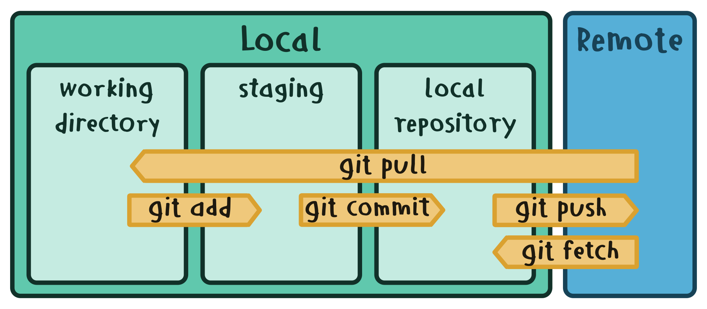
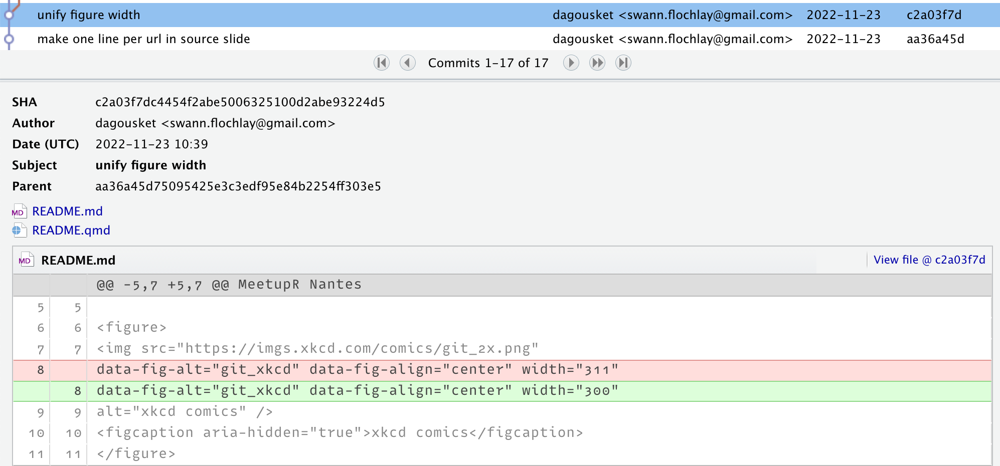

# Introduction à Git et à Github

## Rappels

::: {.incremental}

- Notions importantes en R
- Découverte de l'IDE

:::

. . .

Et maintenant, [Git](https://git-scm.com/) et [Github](https://github.com/) !

## Motivation

::: incremental
-   A on tous sauvé un fichier `final.R`
-   ... qu'on a modifié en `final_extra_analysis.R`
-   ... puis en `final_modif_denis.R` et `final_modif_morgane.R`
-   ... et on a depuis perdu la trace de la dernière sauvegarde 😐
:::

## Où même ça

```{r}
#| code-line-numbers: "|7-12"

# study.R
data |>
    transform() |>
    normalize() |>
    model() |>
    plot()

# Ancienne version --
# data |>
#   transform() |>
#   normalize() |>
#   plot()

data |>
    summarize()
```


## Contrôle de version

Git est un **système de contrôle de version** (SVC) libre. Il relie et unifie les différentes versions d'un même projet entre elles.

::: {.incremental}

Un **système de contrôle de version** (SVC) permet de :

- garder le fil de ses versions
- remonter le temps
- collaborer efficacement
- avoir accès à ses projets partout

:::

## Contrôle de version

Git permet de tracer l'historique des fichiers d'un projet en le représentant sous forme de **graphe**.

Il utilise un modèle distribué léger et performant.

{fig-align="center"}

## Collaboration

{fig-align="center"}

# Fonctionnement de Git

## Git is hard

{fig-align="center"}

## Utilisation de Git

:::: {columns}

::: {.column}
En ligne de commande : terminal unix, mac, wsl2 sous windows, ...

{fig-align="center"}
:::

::: {.column}
Avec des outils graphiques ou dans des IDE/environnements de développement : RStudio, VSCode, gitkraken, ...

{fig-align="center"}
:::

::::


## Installation de Git

Commencez par installer Git sur votre machine :

<https://git-scm.com/book/en/v2/Getting-Started-Installing-Git>

## Configuration Utilisateur

Chaque modification réalisée sur git est associée à la personne qui la réalise. Il faut donc configurer son nom d'utilisateur et son mail (pour se rattacher à son compte GitHub)).

On utilise le package `usethis` :

```{r}
# configurer l'auteur des modifications
usethis::use_git_config(user.name = "Jane", user.email = "jane@example.org")

# verifier la config
usethis::git_sitrep()
```

## Authentification par PAT

Il est vivement conseillé d'utiliser un **Personnal Access token** (PAT) pour accéder à ses _remotes_, pour éviter de laisser trainer son mot de passe Git (avec 2FA bien comme il faut).

On suit la méthode proposée par le package `usethis` :

<https://usethis.r-lib.org/articles/git-credentials.html#get-a-personal-access-token-pat>

## Premier pas

{fig-align="center"}

##  Premier pas {auto-animate="true"}

{fig-align="center"}

## Premier pas {auto-animate="true"}

Si on est fan de terminal, on peut tout faire _à la main_.

```{bash}
# initialiser le dossier actuel avec git
git init

# Paramètrer son nom et son email.
git config user.name "<votre user name>"
git config user.email "<votre email>"
```

{fig-align="center"}

## Les manoeuvres

Y'a plus qu'à se lancer !

{fig-alt="git_cmd" fig-align="center"}

# Les manoeuvres **locales**

## Les manoeuvres **locales**

Sauvegarder les modifications en **local** :

::: incremental
-   `git add` (ou ☑) pour sélectionner les modifications à sauver
-   `git commit` pour valider la nouvelle version du projet
:::

## git add

Pour ajouter des changements en vue de la prochaine validation (prochain commit).

```{bash}
# on ajoute le fichier renv.lock
git add renv.lock
git status
```

. . .

{fig-align="center"}


## git commit

Le commit :

-   est associé à un **message** qui résume son intention

-   garde en mémoire chaque **changement de ligne**

-   possède un **auteur** et un identifiant unique (le **hash**)

-   connait le hash du **commit parent**

. . .

Un "commit" est une validation, qui représente une image de votre projet à un instant donné.

C'est un état qui va être enregistré dans l'historique et qui sera donc atteignable dans le futur.

## git commit

```{bash}
git commit -m "mon premier commit"
```

{fig-align="center"}

## Après le commit {auto-animate="true"}

{fig-align="center"}

## Après le commit {auto-animate="true"}

{fig-align="center"}

## Après le commit {auto-animate="true"}

{fig-align="center"}


## Les outils

On peut explorer toutes nos modifications :

-   **précédentes** avec le `git history` ou `git log`
-   **prévue/staged** avec le `git diff`

# Les manoeuvres **remote**

## Les manoeuvres **remote**

Sauvegarder les modifications en **remote** :

-   `git push` pour mettre à jour le remote avec notre local
-   `git pull` pour récupérer les modifications existantes

Le repository remote est hébergé en ligne (GitHub, GitLab, Gitea), on peut le **cloner** sur une autre machine!

## git push

La commande `git push` est utilisée pour uploader des données locales vers un répertoire distant, par exemple, un projet partagé sur github.

. . .

```{bash}
git push origin main
# origin : nom du serveur distant
# main : branche
```

Pour pousser sur le dépôt distant origin le contenu de la branche main

## Avant de push

Il faut définir un `remote`(dépôt distant), par exemple un dépôt github :

```{bash}
# origin est le nom par convention du dépôt distant principal
git remote add origin git@github.com:<username>/<projectname>.git
```

{fig-align="center"}

---

## {auto-animate="true"}

{fig-align="center"}

---

## {auto-animate="true"}

:::: {.columns}

::: {.column width="50%"}

{fig-align="center"}

:::

::: {.column width="50%"}

1. `git add` pour lister les fichiers à `commit`
2. `git commit` pour sauvegarder un état donné
3. `git push` pour synchroniser ces changements avec un dépôt distant

:::

::::

## git pull

> La commande `git pull` est utilisée pour mettre à jour des données locales depuis un répertoire distant, par exemple, un projet partagé sur github.

```{bash}
git pull origin main
# origin : nom du serveur distant, main : branche
```

On merge la branche `main` du dépôt `origine` avec notre branche courante de travail.

## git fetch ?


Un `git pull` est équivalent à un `git fetch` + `git merge`. L'option un est jugée moins sûre que l'option 2 mais plus simple pour démarrer sur des projets avec des workflow simples.

# Et les branches?

## Les branches

Une **nouvelle branche** permet de :

-   créer plusieurs versions à partir d'une même base

-   intégrer des corrections une fois validée/terminée

-   collaborer efficacement

-   et on y a encore accès partout

## Les branches

On *duplique* une base en une nouvelle branche. Les prochains commit sont spécifiques à la branch active (`git show HEAD`).

{fig-alt="git branch" fig-align="center"}

## git branch, git switch, git checkout

-   `git branch <new-branch>` pour créer une branche
-   `git switch <new-branch>` pour la définir comme active
-   `git checkout <new-branch>` pour la définir comme active
-   `git push -–set-upstream` pour ajouter la branch au remote

## git branch, git switch, git checkout

La commande `git branch` sert à créer des branches en parallèle de la branche principale `main` ou `master`.

Utile lorsque l'on collabore à plusieurs, pour créer des branches de fonctionnalités (feature branch), dans de nombreux workflow...

Voir [ici](https://www.atlassian.com/git/tutorials/comparing-workflows#:~:text=A%20Git%20workflow%20is%20a,in%20how%20users%20manage%20changes.) pour une présentation de workflows possibles.

La commande `git switch` permet de changer de branche. La commande `git checkout` permet entre autres de changer de branche.

```{bash}
git branch feature-1
git switch feature-1
git checkout main
```

## Relier les branches

On *intègre* les `commit` d'une branche dans une autre (`git merge`).

{fig-alt="git merge" fig-align="center"}

## Relier les branches

-   `git merge <my_branch>` ou `git rebase <master> <my_branch>` intègre *my_branch* dans la branche active
-   le `git pull` est un merge entre le remote et le local
-   un **merge conflict** peut arriver entre commit

## git merge, git rebase

Lorsque l'on souhaite fusionner deux branches, on peut réaliser deux types d'opérations :

- `git merge`
- `git rebase`

Ces deux opérations diffèrent par la manière de fusionner les historiques (`merge` préserve l'historique complet, quand `rebase` réécrit l'historique).

## Relier les branches

En collaboration, on peut créer un `pull request` de notre branch sur un repo remote pour demander à intégrer nos `commit` dans la master branch.

{fig-alt="pull request" fig-align="center"}

# Quelques astuces pour la route

## .gitignore

Il est possible d'écrire un fichier .gitignore pour ne pas traquer certains fichiers:

- fichiers volumineux
- fichiers générés à la volée qui ne doivent pas être sauvegardés (.pdf quand les sources sont dispos)
- fichiers sensibles


## Secrets

Il est facile de glisser des 'secrets' dans ses scripts et que ceux-ci se retrouvent dans un historique git :

- mots de passe
- token
- informations sensibles

Attention aux fichiers que vous enregistrez dans vos commits (comme le .Rhistory). Soyez vigilants.


## En résumé

::: {.incremental}

- Utile pour créer de (nombreux) points de sauvegarde de vos projets
- Indispensable à la collaboration
- Outil de référence en développement logiciel
- 95% de vos usages sont couverts par les instructions `add`, `commit`, `push` et `pull`.
- Outil extrêmement versatile et complexe (impossible ?) à maitriser dans sa totalité : c'est normal !
- **Outil indispensable pour le data scientist**

:::

---

{fig-alt="git commit" fig-align="center"}


## Documentation

- [git cheatsheet](https://training.github.com/downloads/fr/github-git-cheat-sheet.pdf)
- [Github training](https://skills.github.com/)
- [Pro Git](https://git-scm.com/book/en/v2)
- [Documentation officielle](https://git-scm.com/docs)

# Github et cie

## Plateforme de collaboration

- [Github](https://github.com/)
- [Gitlab](https://about.gitlab.com/)
- [Atlassian BitBucket](https://bitbucket.org/product/)

## Github

- Compte personnel gratuit
- Possibilité de créer des projets publics et privés
- Possibilité d'automatiser des tâches avec des Github Actions
- Possibilité d'héberger des sites webs statiques (blog, sites perso, documentation) depuis Github Pages

# Visite de github

## Github Actions

Les github actions sont des outils de CI/CD (continuous integration / continuous delivery) qui permettent l'automatisation de certaines tâches en réponse à un évenement (un push, un commit, sur une branche, ...).

- [Documentation](https://docs.github.com/fr/actions) github actions
- [Actions workflow R](https://github.com/r-lib/actions)
- [Actions quarto](https://github.com/quarto-dev/quarto-actions)

::: {.callout-tip}

## Quarto

Quarto est un outil de programmation "littéraire" de type notebook : plus à propos de Quarto lors du dernier cours.

:::

## Github Pages

Github permet l'hébergement de sites web statiques par le biais des Github Pages. Ceci rend possible une intégration forte entre votre code et le déploiement d'un site. C'est très pratique pour héberger la documentation d'un package, un site personnel, ou tout site statique.

- [Documentation](https://pages.github.com/) des Github Pages

# En résumé

::: {.incremental}

- Git est un outil complexe mais indispensable au data scientist
- Une maîtrise premiers concepts simples suffira amplement à couvrir la majorité de vos besoins
- Github est la plateforme leader, des alternatives existent
- Utile pour se créer un portfolio, collaborer avec des camarades, persister du code de manière fiable
- Github doit aussi être une source d'inspiration et d'information pour vous !

:::
